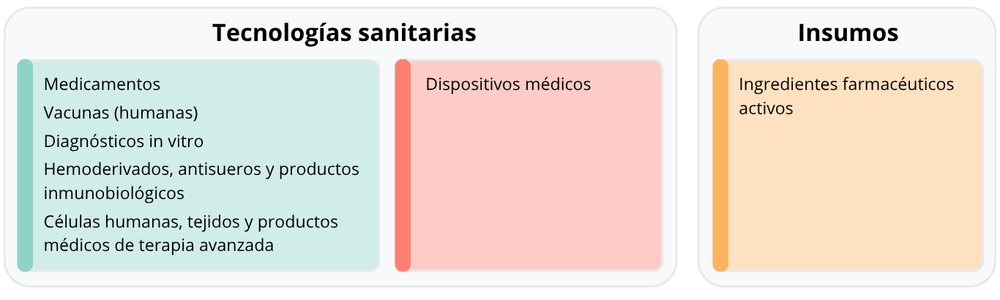

```{r}
#| label: setup-landing
#| include: false

source("r/02_functions_plots.R", encoding = "UTF-8")

exports_region <- load_dashboard_data(
  "exports_region_hc_cat2.rds",
  data_dir = "data/dashboard"
)

trade_balance <- load_dashboard_data(
  "trade_balance_lac.rds",
  data_dir = "data/dashboard"
)

category_links <- c(
  "Células humanas, tejidos y productos médicos de terapia avanzada" = "terapias-avanzadas.html",
  "Diagnósticos in vitro" = "diagnosticos-in-vitro.html",
  "Dispositivos médicos" = "dispositivos-medicos.html",
  "Hemoderivados, antisueros y productos inmunobiológicos" = "hemoderivados-inmunobiologicos.html",
  "Ingredientes farmacéuticos activos" = "ifas.html",
  "Medicamentos" = "medicamentos.html",
  "Vacunas (humanas)" = "vacunas-humanas.html"
)

landing_group_colors <- c(
  other_health = "#8dd3c7",
  devices = "#fb8072",
  inputs = "#fdb462"
)

landing_device_categories <- c(
  hc_cat2_levels[[3]]
)

landing_input_categories <- c(
  hc_cat2_levels[[5]]
)

landing_category_groups <- tibble::tibble(
  hc_cat2 = hc_cat2_levels,
  landing_kpi_group = dplyr::case_when(
    hc_cat2 %in% landing_device_categories ~ "devices",
    hc_cat2 %in% landing_input_categories ~ "inputs",
    TRUE ~ "other_health"
  ),
  landing_kpi_color = unname(landing_group_colors[landing_kpi_group])
)

landing_kpis <- prepare_landing_category_kpis(
  exports_region = exports_region,
  trade_balance = trade_balance,
  category_links = category_links,
  category_groups = landing_category_groups
)
```

El dashboard analiza el comercio internacional de tecnologías sanitarias e insumos en América Latina y el Caribe a partir de los datos de [CEPII-BACI](https://www.cepii.fr/DATA_DOWNLOAD/baci/doc/baci_webpage.html), con nomenclatura HS 2007.

Los productos se clasificaron en siete categorías de uso común en la industria, cada una cuenta con una pestaña independiente en el dashboard:

::: {.landing-category-diagram}

{fig-alt="Diagrama de categorías de productos" fig-align="center" width=70%}

:::


```{r}
#| label: landing-category-kpis
#| results: asis

render_landing_kpi_cards(landing_kpis)
```


